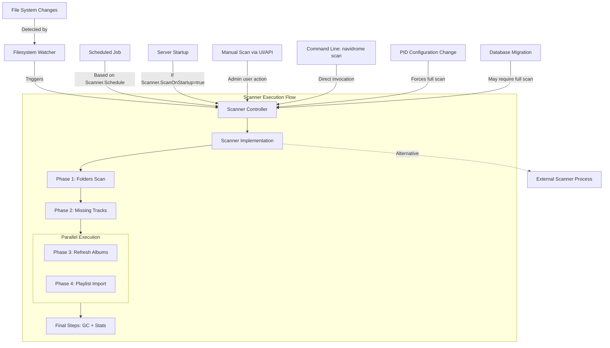
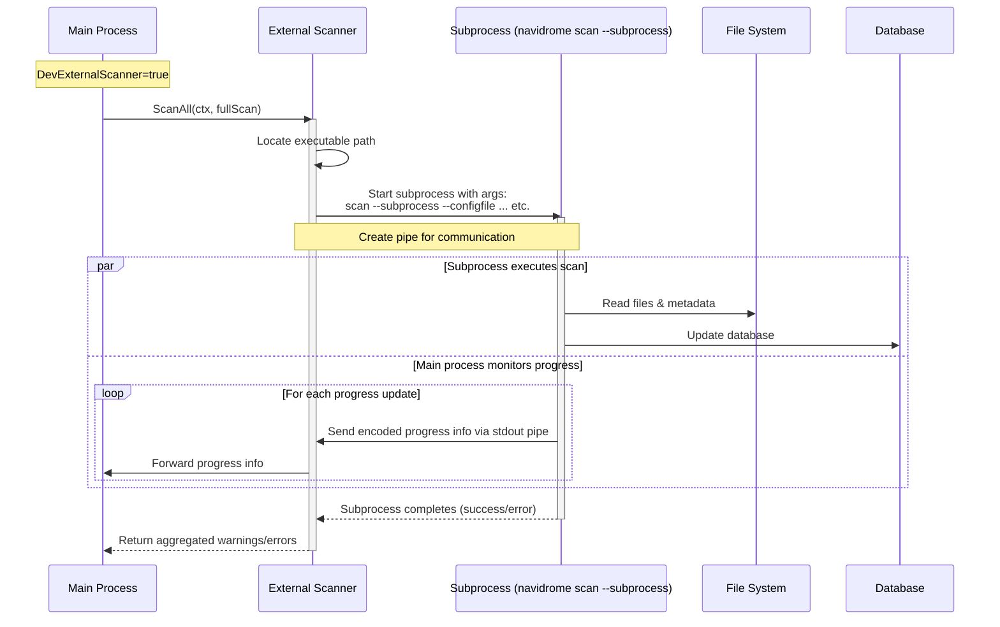
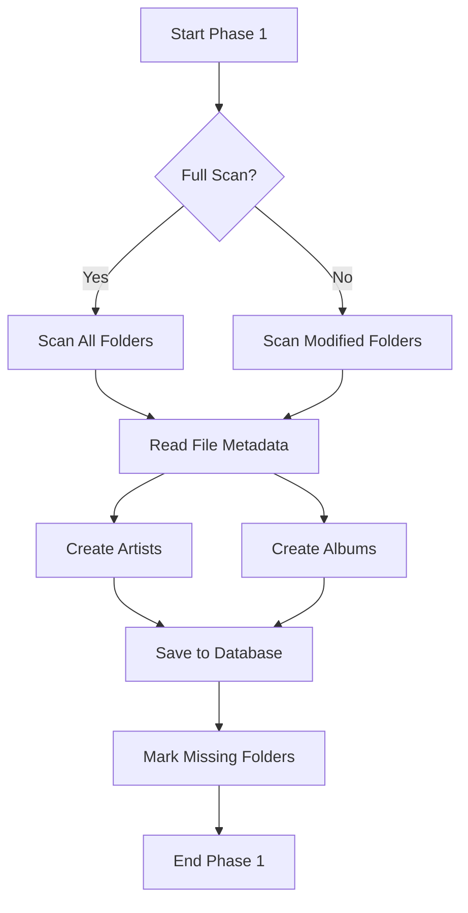
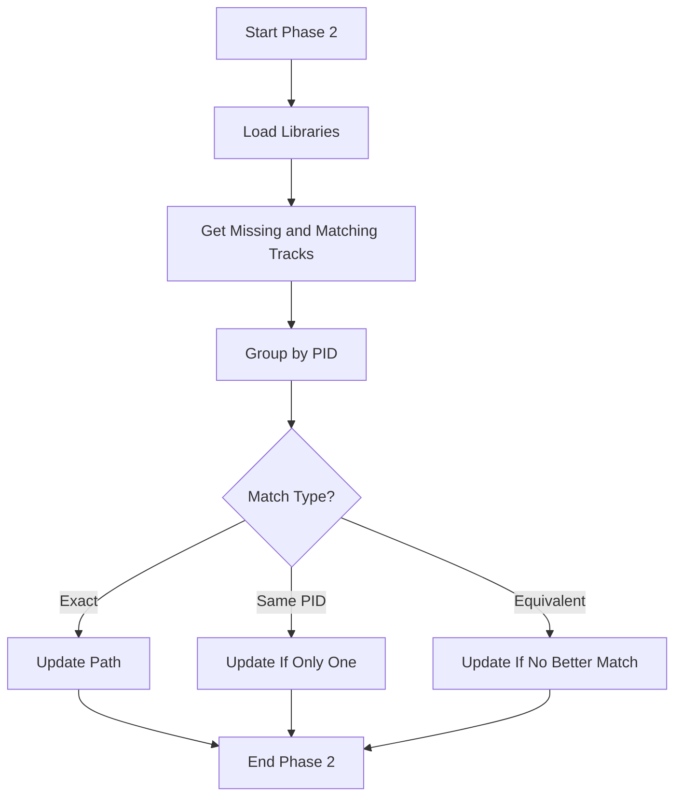
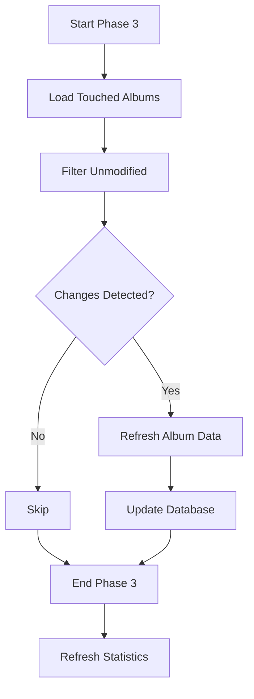
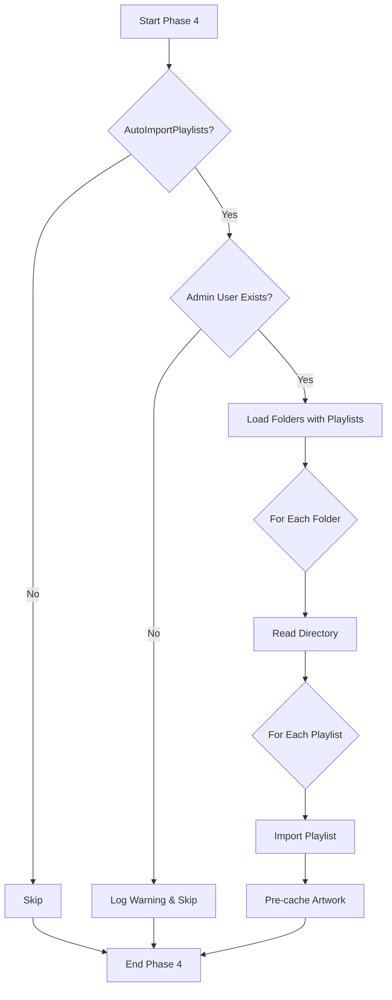
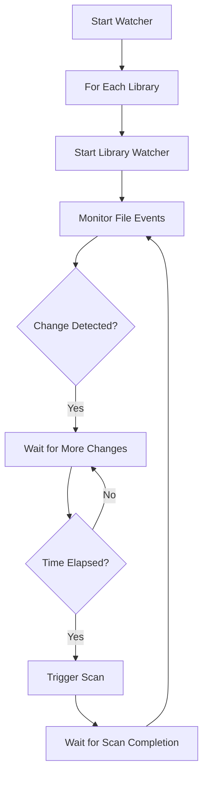

# Navidrome 扫描器：技术概述

本文档对 Navidrome 的音乐媒体库扫描系统提供了全面的技术说明。

## 架构概述

Navidrome 扫描器基于多阶段流水线架构构建，旨在高效处理音乐文件。它会系统地遍历文件系统目录、处理元数据，并维护媒体库的数据库表示。一个关键的性能特性是：部分阶段按顺序执行，而其他阶段则并行执行。



执行流程显示，阶段 1 和阶段 2 顺序执行，而阶段 3 和阶段 4 并行执行，以便在最终处理步骤之前最大化性能。

## 核心组件

### 扫描控制器（`controller.go`）

这是所有扫描操作的入口点。它提供：

- 用于发起扫描和检查扫描状态的公开 API
- 事件广播，用于将扫描进度通知客户端
- 扫描操作的串行化（防止并发扫描）
- 进度跟踪与监控
- 错误收集与报告

```go
type Scanner interface {
    // ScanAll starts a full scan of the music library. This is a blocking operation.
    ScanAll(ctx context.Context, fullScan bool) (warnings []string, err error)
    Status(context.Context) (*StatusInfo, error)
}
```

### 扫描器实现（`scanner.go`）

用于编排四阶段扫描流水线的主要实现。每个阶段都遵循 Phase 接口模式：

```go
type phase[T any] interface {
    producer() ppl.Producer[T]
    stages() []ppl.Stage[T]
    finalize(error) error
    description() string
}
```

这种设计带来了：
- 基于泛型的类型安全流水线构建
- 模块化的阶段实现
- 关注点分离
- 便于衡量性能

### 外部扫描器（`external.go`）

外部扫描器是一种专门的实现，它将扫描过程卸载到一个独立的子进程中。这是专门为解决长期运行的 Navidrome 实例中的内存管理难题而设计的。

```go
// scannerExternal is a scanner that runs an external process to do the scanning. It is used to avoid
// memory leaks or retention in the main process, as the scanner can consume a lot of memory. The
// external process will be spawned with the same executable as the current process, and will run
// the "scan" command with the "--subprocess" flag.
//
// The external process will send progress updates to the main process through its STDOUT, and the main
// process will forward them to the caller.
```



技术细节：

1. **进程隔离**
    - 使用同一可执行文件生成一个独立进程
    - 使用 `--subprocess` 标志表明其正作为子进程运行
    - 通过传递所需标志（`--configfile`、`--datafolder` 等）保留配置

2. **进程间通信**
    - 使用管道进行双向通信
    - 使用 Go 的 `gob` 编码对进度更新进行编码/解码，以实现高效的二进制传输
    - 妥善处理进程终止和错误传播

3. **内存管理优势**
    - 扫描操作可能占用大量内存，尤其是在媒体库规模较大时
    - 内存泄漏或过度分配会在进程终止时被自动清理
    - 即使扫描器遇到与内存相关的问题，主 Navidrome 进程也能保持稳定

4. **错误处理**
    - 检测子进程的非零退出码
    - 将错误消息传播回主进程
    - 即使在出错的情况下也能确保资源被妥善清理

## 扫描处理流程

### 阶段 1：文件夹扫描（`phase_1_folders.go`）

此阶段负责初始的目录遍历和媒体文件处理。



**技术实现细节：**

1. **目录遍历**
    - 使用 `walkDirTree` 遍历目录结构
    - 处理符号链接和隐藏文件
    - 处理 `.ndignore` 文件以进行排除
    - 将文件映射到相应的类型（音频、图片、播放列表）

2. **元数据提取**
    - 以批处理方式处理文件（由 `filesBatchSize = 200` 定义）
    - 使用配置的存储后端提取元数据
    - 将原始元数据转换为 `MediaFile` 对象
    - 收集并规范化标签信息

3. **专辑与艺人创建**
    - 按专辑 ID 对曲目进行分组
    - 从曲目元数据创建专辑记录
    - 通过跟踪先前的 ID 来处理专辑 ID 变更
    - 从曲目参与者创建艺人记录

4. **数据库持久化**
    - 使用事务实现原子更新
    - 在 ID 变更时保留专辑注解
    - 更新媒体库与艺人的映射
    - 标记缺失的曲目以供后续处理
    - 预缓存封面以提升性能

### 阶段 2：缺失曲目处理（`phase_2_missing_tracks.go`）

此阶段识别已被移动或删除的曲目。



**技术实现细节：**

1. **曲目识别策略**
    - 使用持久标识符（PID）在多次扫描之间跟踪曲目
    - 从数据库加载缺失的曲目和潜在匹配项
    - 按 PID 对曲目分组以限制比较范围

2. **匹配分析**
    - 应用三级匹配标准：
        - 精确匹配（完全元数据等价）
        - 针对某个 PID 的单一匹配
        - 等价匹配（相同的基础路径或相似的元数据）
    - 按置信度优先顺序排列匹配

3. **数据库更新策略**
    - 保留原始曲目 ID
    - 将路径更新为新位置
    - 删除重复条目
    - 使用事务确保原子性

### 阶段 3：专辑刷新（`phase_3_refresh_albums.go`）

此阶段根据最新的曲目元数据更新专辑信息。



**技术实现细节：**

1. **专辑选择逻辑**
    - 加载在前序阶段中被“触碰”过的专辑
    - 使用生产者-消费者模式进行高效处理
    - 检索每张专辑的所有媒体文件以确保完整性

2. **变更检测**
    - 从关联的曲目重建专辑元数据
    - 比较专辑属性是否有变化
    - 跳过没有媒体文件的专辑
    - 避免不必要的数据库更新

3. **统计刷新**
    - 更新专辑播放次数
    - 更新艺人播放次数
    - 维护相关实体之间的一致性

### 阶段 4：播放列表导入（`phase_4_playlists.go`）

此阶段从文件系统导入并更新播放列表。



**技术实现细节：**

1. **播放列表发现**
    - 加载已知包含播放列表的文件夹
    - 聚焦于前序阶段中被触碰过的文件夹
    - 处理两种播放列表格式（M3U、NSP）

2. **导入过程**
    - 使用 core.Playlists 服务进行导入
    - 处理普通播放列表和智能播放列表
    - 当播放列表发生变化时更新现有播放列表
    - 预缓存播放列表封面

3. **配置感知**
    - 遵循 AutoImportPlaylists 设置
    - 导入播放列表需要管理员用户
    - 针对配置问题记录相应的日志消息

## 最终处理步骤

在四个主要阶段之后，会执行若干收尾步骤：

1. **垃圾回收**
    - 移除没有文件的悬空曲目
    - 清理空专辑
    - 移除孤立的艺人
    - 删除孤立的注解

2. **统计刷新**
    - 更新艺人的歌曲数和专辑数
    - 刷新标签使用统计
    - 更新聚合指标

3. **媒体库状态更新**
    - 将扫描标记为已完成
    - 更新上次扫描时间戳
    - 存储持久 ID 配置

4. **数据库优化**
    - 执行数据库维护
    - 优化表和索引
    - 从已删除的记录中回收空间

## 文件系统监听

监听系统（`watcher.go`）提供对文件系统变更的实时监控：



**技术实现细节：**

1. **事件节流**
    - 使用定时器批量处理变更
    - 防止过度重复扫描
    - 可配置的等待时间

2. **按媒体库监听**
    - 每个媒体库都有自己的监听 goroutine
    - 将路径转换为相对于媒体库的路径
    - 过滤无关的变更

3. **平台适应性**
    - 使用存储后端提供的监听实现
    - 支持每个平台不同的通知机制
    - 在不支持监听时优雅降级

## 边界情况与优化

### 处理专辑 ID 变更

扫描器会谨慎地管理跨多次扫描的专辑身份：
- 跟踪先前的专辑 ID 以处理 ID 生成变更
- 在 ID 变更时保留注解
- 维护创建时间戳以保持一致的排序

### 检测移动的文件

一个精巧的算法可识别移动的文件：
1. 按持久 ID 对缺失文件和新文件进行分组
2. 按优先级顺序应用多种匹配策略
3. 更新路径而非创建重复条目

### 恢复被中断的扫描

如果扫描被中断：
- 下一次扫描会检测到这一情况
- 如果前一次是完整扫描，则强制进行完整扫描
- 对于增量扫描，则从中断处继续

### 内存效率

多种策略可最大限度减少内存占用：
- 批量处理文件（每次 200 个文件）
- 可选的外部扫描器进程
- 尽可能在数据库端进行过滤
- 使用流水线进行流式处理

### 并发控制

扫描器实现了精巧的并发模型以优化性能：

1. **阶段级并行**：
    - 阶段 1 和阶段 2 由于存在依赖而顺序执行
    - 阶段 3 和阶段 4 使用 `chain.RunParallel()` 函数并行执行
    - 最终步骤顺序执行以确保数据一致性

2. **阶段内并发**：
    - 每个阶段都为其各个阶段配置了并发度
    - 例如，`phase_1_folders.go` 并发处理文件夹：`ppl.NewStage(p.processFolder, ppl.Name("process folder"), ppl.Concurrency(conf.Server.DevScannerThreads))`
    - 一个阶段内可以存在多个阶段，每个阶段都有自己的并发级别

3. **流水线架构的优势**：
    - 生产者-消费者模式可最大限度减少内存占用
    - 工作以流式方式流经各个阶段，而非累积
    - 背压被自动管理

4. **线程安全机制**：
    - 用于统计收集的原子计数器
    - 用于共享资源的互斥锁保护
    - 事务性数据库操作

## 配置选项

扫描器的行为可以通过若干直接影响其运行的配置设置进行自定义：

### 核心扫描选项

| Setting                 | Description                                                      | Default        | 
|-------------------------|------------------------------------------------------------------|----------------|
| `Scanner.Enabled`       | 是否启用自动扫描器                                                 | true           |
| `Scanner.Schedule`      | 定时扫描的 Cron 表达式或持续时间（例如 "@daily"）                  | "0" (disabled) |
| `Scanner.ScanOnStartup` | 是否在服务器启动时进行扫描                                         | true           |
| `Scanner.WatcherWait`   | 检测到文件变更后触发扫描前的延迟                                   | 5s             |
| `Scanner.ArtistJoiner`  | 用于连接曲目元数据中多个艺人的字符串                               | " • "          |

### 播放列表处理

| Setting                     | Description                                              | Default |
|-----------------------------|----------------------------------------------------------|---------|
| `PlaylistsPath`             | 用于搜索播放列表的路径（支持 glob 模式）                  | ""      |
| `AutoImportPlaylists`       | 是否在扫描期间导入播放列表                                | true    |

### 性能选项

| Setting              | Description                                               | Default |
|----------------------|-----------------------------------------------------------|---------|
| `DevExternalScanner` | 使用外部进程进行扫描（减少内存问题）                       | true    |
| `DevScannerThreads`  | 扫描期间并发处理线程的数量                                 | 5       |

### 持久 ID 选项

| Setting     | Description                                                         | Default                                                             |
|-------------|---------------------------------------------------------------------|---------------------------------------------------------------------|
| `PID.Track` | 曲目持久 ID 的格式（对跟踪移动的文件至关重要）                       | "musicbrainz_trackid\|albumid,discnumber,tracknumber,title"         |
| `PID.Album` | 专辑持久 ID 的格式（影响专辑分组）                                   | "musicbrainz_albumid\|albumartistid,album,albumversion,releasedate" |

这些选项可以在 Navidrome 配置文件（例如 `navidrome.toml`）中设置，也可以通过带有 `ND_` 前缀的环境变量设置（例如 `ND_SCANNER_ENABLED=false`）。对于环境变量，选项名称中的点会被替换为下划线。

## 结论

Navidrome 扫描器是一个用于高效管理音乐媒体库的精巧系统。其基于阶段的流水线架构、对边界情况的细致处理以及性能优化，使其能够在保持数据完整性的同时处理相当规模的媒体库，并提供响应迅速的用户体验。
